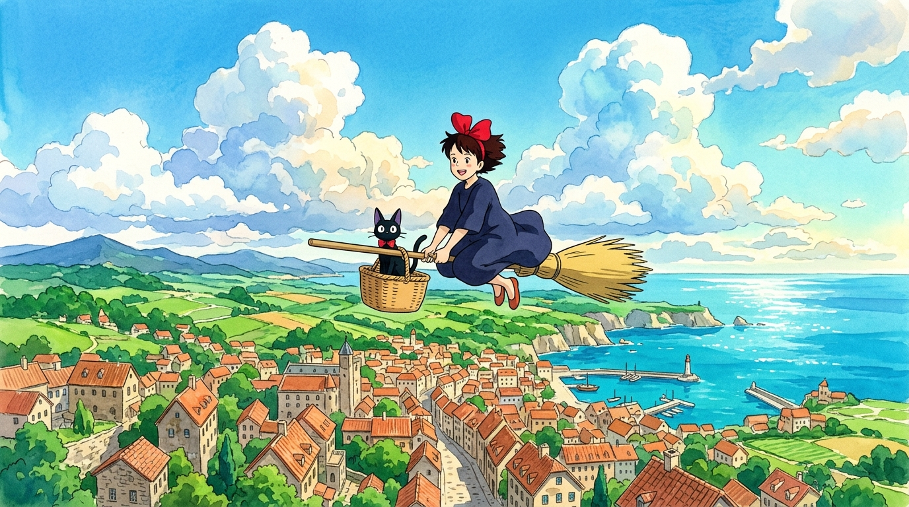

  

 

# 🧙‍♀️ Wind Whisper Courier
**Fly. Deliver. Soar.**

---

## Q1 — The Pitch

**What is it, who's it for, and why would someone play it?**

Wind Whisper Courier is a 3D browser flying game — no install, just a URL. You play as a witch courier on a broomstick, picking up parcels and delivering them across a Ghibli-style coastal town before the timer runs out and the parcel goes cold.

It's for **all ages** — and especially for **Ghibli fans who've watched Kiki's Delivery Service** and want to *live inside that world*. Anyone who has ever wanted to fly a broomstick over rooftops with something warm in their hands has a reason to play this.

---

## Q2 — Core Loop & First Session

**What does a player do in the first few minutes, and what brings them back tomorrow?**

**First few minutes:**
- Land on the welcome screen → choose difficulty → hit Play
- Mount the broom at Guzior Bakery → take off → fly toward the golden beacon pillar
- Keep the parcel warm by flying through chimney smoke updrafts
- Thread sky rings for +3s time bonuses
- Land at the Grand Clock Tower → receive a grade + Bread Stamps → read the NPC delivery quote → start the next chapter

The game teaches itself. No tutorial text walls — the warmth bar tells you the parcel is cooling, the golden pillar tells you where to go. Controls click within 60 seconds.

**What brings them back tomorrow:**
- 6 campaign chapters that chain across the map, each unlocking the next
- Persistent Courier Rank (Apprentice → Master Witch) that doesn't reset
- 6 hidden origami sparrows, 12 balloons, and bread coins scattered across the world — collected permanently
- 8 achievement badges visible in the journal but locked — a constant pull

---

## Q3 — Progression & Metagame

**What's the Day-1 hook, and what keeps someone playing for months?**

**Day-1 hook — The Warmth Mechanic:** Your parcel isn't just a destination, it's *living cargo*. It cools every second — faster at high speed — so the player is always in a push-pull: *fly faster to arrive on time, but flying faster cools the parcel*. Fly through chimney updrafts to restore warmth. This one mechanic teaches altitude, route planning, and world geography entirely through feel.

**Long-term — the Wardrobe and Rank ladder:** Every delivery earns Bread Stamps. Stamps unlock couriers, brooms, and flight trails in the Wardrobe. The Courier Rank score is composite — deliveries, sparrows found, balloons popped, total stamps — so there's always something to push. Six story chapters, eight badges, a slalom ring course, and photo mode all extend the reason to keep flying.

---

## Q4 — Money

**How would it make money without feeling like a cash grab?**

A **Wardrobe / Shop** where players buy and upgrade cosmetic items — no gameplay advantage, ever.

Two currencies:
- 🥖 **Bread Stamps** — earned by playing (deliveries, ring combos, badge rewards). Used to unlock free-tier couriers, brooms, and trails
- ✨ **Golden Feathers** — bought with real money in small bundles ($0.99 → $14.99). Used to unlock premium cosmetics faster

Every item in the premium tier can also be earned through enough gameplay. Purchases are optional and confirm before deducting. The shop is framed as a gift shop, not a toll booth.

---

## Q5 — AI

**How was AI used to build it, and is AI part of the game itself?**

**Building it:** AI LLMs were used to build this game — architecture, physics tuning, 3D world layout, the GLSL sky shader, and the procedural audio engine. AI compressed weeks of iteration into hours.

**In the game itself — V2 vision:** Claude API (Anthropic) will power live NPC dialogue. Instead of static delivery quotes, each NPC will respond dynamically based on your grade, parcel freshness, and even which character skin you're wearing. Every delivery becomes a unique, personalized moment — no writer needed for thousands of permutations.

---

## Q6 — Shipping

**What would you test first, what would make you kill it, and what numbers would you watch?**

**Test first:** Does the broom flight feel immediately satisfying on first touch? Does the mobile touch joystick work on iOS Safari? Does the welcome screen convert to PLAY in under 10 seconds?

**Kill / pivot if:** Average session completes fewer than 1 delivery, or mobile bounce is above 60% before first flight.

**Numbers to watch at soft launch:**
- **Unique plays** — the primary number I'd watch (browser game, no app store)
- **D1 Retention** — do players come back the next day? This tells you if the loop has real pull
- **Session length** — are players staying long enough to complete more than one chapter?

---

## Q7 — Reference Games

**What did you play, what did you borrow, and what did you do differently?**

**Inspiration:** Kiki's Delivery Service (Miyazaki, 1989). The warmth mechanic, chimney updrafts, named NPC recipients, and coastal town are all drawn from the film. That's the only reference used.

**Closest competitor:** Mika and the Witch's Mountain — witch, broomstick, package delivery, coastal island, Kiki DNA. The overlap is coincidental; Mika was not referenced or played during development. It's also a $19.99 download on Steam/Switch/PS/Xbox.

**What's different:** Wind Whisper Courier runs in a browser — no install, no cost. The warmth mechanic adds a routing puzzle that Mika doesn't have: fly fast and the parcel cools, find chimney updrafts or fail the delivery.

---

*「飛ぶことは、魔法ではなく、練習だ。」*
*Flying is not magic. It is practice.*

